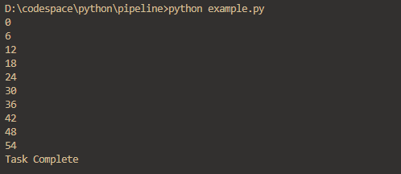

### Pipeline Design Pattern


Example Use case

```
from pipeline import Pipeline


class AllNumbers(Pipeline):

    def __init__(self):
        super(AllNumbers,self).__init__()
        def generator():
            value = 0
            while True:
                yield value
                value += 1
        self.source = generator()
        
class Evens(Pipeline):

    def filter(self, value):
        return value % 2 == 0

class MultipleOf(Pipeline):

    def __init__(self,factor = 1):
        self.factor = factor
        super(MultipleOf,self).__init__()

    def filter_data(self, value):
        return value % self.factor == 0        

class Printer(Pipeline):

    def map_data(self, value):
        print(value)
        return value

class First(Pipeline):

    def __init__(self, total  = 10):
        super(First,self).__init__()
        self.total = total
        self.count = 0
        
    def map_data(self, value):
        self.count += 1
        if self.count > self.total:
            raise StopIteration 
        return value


all_numbers = AllNumbers()
evens = MultipleOf(2)
multipleOf3 = MultipleOf(3)


first_10 = First(10)
pinter = Printer()


pipeline = all_numbers|evens|multipleOf3|first_10|pinter

#pipeline = all_numbers|evens
pipe = iter(pipeline)

try:
    while True:
        next(pipe)
except StopIteration:
    print('Task Complete')    
```
